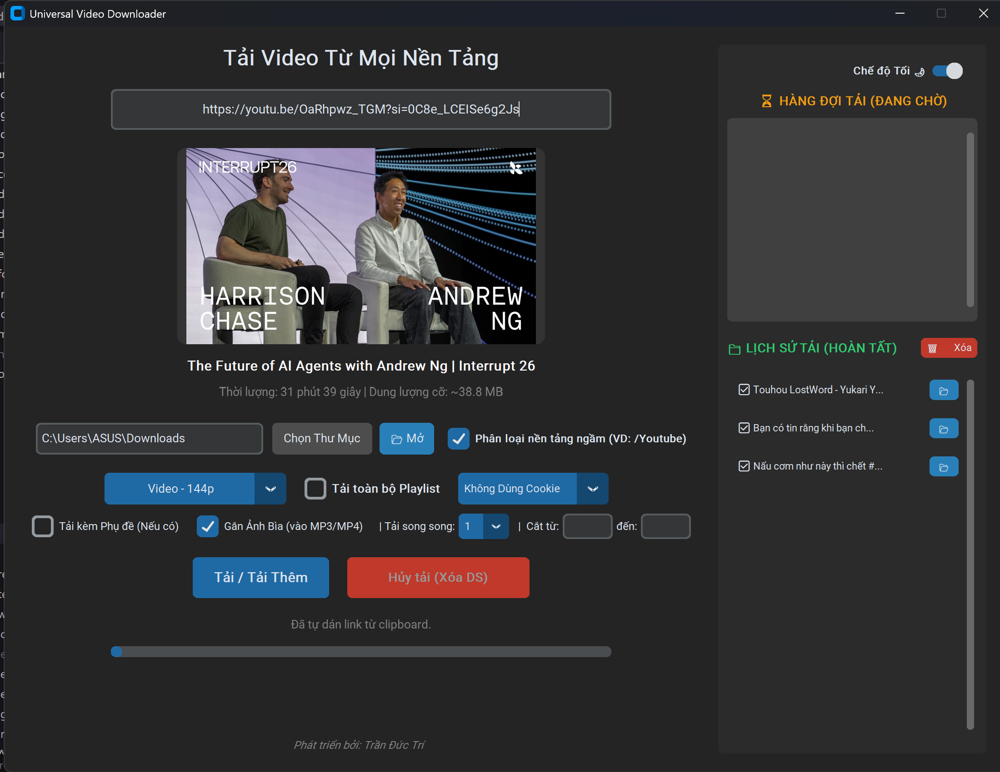
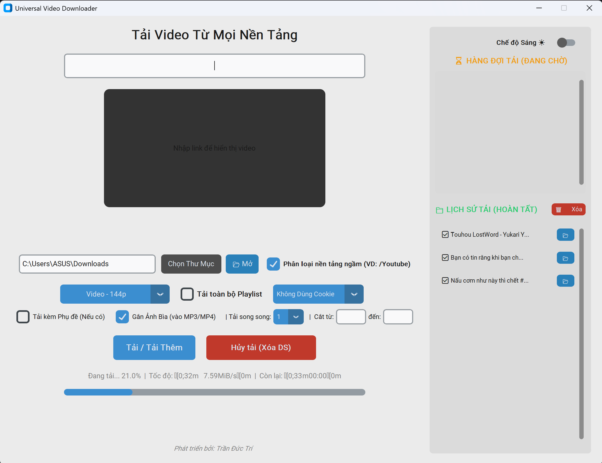
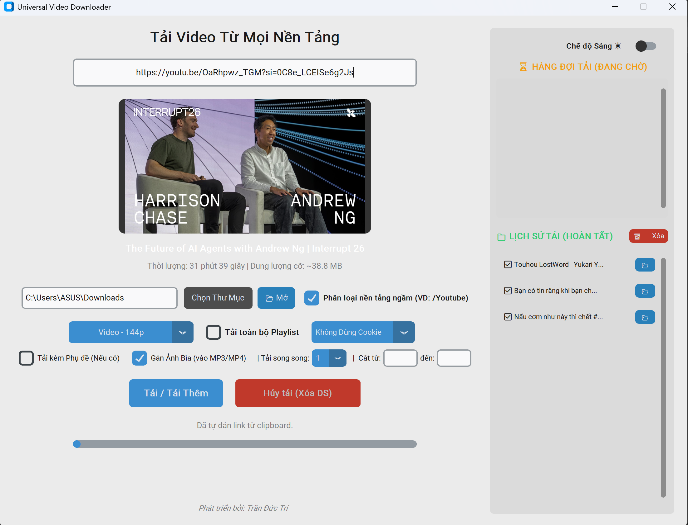

# Universal Video Downloader

[](https://github.com/tridpt/UniversalVideoDownloader/actions/workflows/tests.yml)
[](https://github.com/tridpt/UniversalVideoDownloader/releases/latest)
[](LICENSE)


A powerful, modern, and cross-platform video and audio downloader built with Python and CustomTkinter. It leverages the robust `yt-dlp` library to provide seamless downloading capabilities from almost any platform, including YouTube, Facebook, TikTok, Instagram, Twitter (X), and SoundCloud.



## ⬇️ Tải về (Download)

Tải bản `.exe` mới nhất cho Windows tại trang [Releases](https://github.com/tridpt/UniversalVideoDownloader/releases/latest) — không cần cài Python, chạy trực tiếp.

Nếu muốn chạy từ mã nguồn, xem phần [Cài đặt & Yêu cầu](#-installation--requirements) bên dưới.

## 🌟 Features

* **Multi-Platform Support**: Download videos from YouTube, TikTok, Facebook, Instagram, X (Twitter), SoundCloud, and many more sites supported by `yt-dlp`.
* **High-Quality Formats**: Choose from various resolutions (1080p, 720p, 480p, Best Video) or extract audio directly to MP3.
* **Modern GUI**: A beautiful, user-friendly interface built with `CustomTkinter`, including easy toggles for Light and Dark themes.
* **Playlist & Channel Downloads**: Easily download entire playlists or specific, filtered videos from a playlist.
* **Smart Organization**: Automatically categorizes downloaded videos into specific folders based on the source platform (e.g., `/YouTube`, `/TikTok`).
* **Advanced Options**:
  * Option to download and embed subtitles (English/Vietnamese).
  * Embed video thumbnails directly into the MP4/MP3 files.
  * Time-based cutting/cropping: Download specific parts of a video by specifying start and end times.
  * Browser Cookie integration: Bypass age-restricted or private content by using cookies from your installed browsers (Chrome, Edge, Firefox, Brave).
* **Download Queue & History**: Queue up multiple downloads at once. Easily review your download history and quickly open download folders.
* **Desktop Notifications**: Get a system notification when the whole queue finishes.
* **Concurrent Downloads**: Download up to 4 videos in parallel for long queues.
* **Drag & Drop**: Drop a link or file path onto the input box (requires optional `tkinterdnd2`).
* **Open File Directly**: Open the finished file (not just its folder) straight from the history list.

## 🚀 Installation & Requirements

Ensure you have **Python 3.10+** installed on your system. 

1. **Clone the repository:**
   ```bash
   git clone https://github.com/tridpt/UniversalVideoDownloader.git
   cd UniversalVideoDownloader
   ```

2. **Install dependencies:**
   Install required Python packages utilizing `pip`:
   ```bash
   pip install customtkinter yt-dlp Pillow requests static_ffmpeg
   ```
   *Note on FFmpeg: The app automatically locates FFmpeg from the `static_ffmpeg` package if installed. Otherwise, it falls back to any `ffmpeg` available on your system `PATH`. No manual path editing is required.*

   Optional extras:
   ```bash
   pip install plyer        # desktop notifications when downloads finish
   pip install tkinterdnd2  # drag & drop links/files onto the window
   ```
   *Both are optional — the app runs fine without them, just without those specific features.*

3. **Run the App:**
   ```bash
   python main.py
   ```

## 🛠️ Usage

1. **Paste a Link**: Put the video URL in the input box. The app will fetch the video details (Title, Thumbnail, Size estimate) automatically.
2. **Choose Format**: Select your desired quality or select 'Audio (MP3)'.
3. **Save Directory**: Choose where you want to save the files. Checking 'Smart Folder' will auto-create subfolders based on the website.
4. **Download**: Hit "Tải / Tải Thêm" to queue the video. You can queue multiple links simultaneously. 

## 📸 Screenshots

| Main window | Downloading queue | Light theme |
| --- | --- | --- |
|  |  |  |

## 🗂️ Project Structure

The codebase is split into focused modules to keep logic testable and the UI thin:

| File | Responsibility |
| --- | --- |
| `main.py` | GUI (CustomTkinter) and orchestration |
| `core.py` | Pure logic: time parsing, format strings, resolution detection, FFmpeg path, folder classification |
| `downloader.py` | Builds `yt-dlp` options and output templates |
| `config_store.py` | Reads/writes user config and download history (JSON) |
| `test_core.py`, `test_downloader.py` | Pytest suites for the pure-logic modules |

## ✅ Running Tests

The pure-logic modules are covered by a pytest suite (no GUI required):

```bash
pip install pytest
pytest -v
```

Tests run automatically on every push and pull request via GitHub Actions (Python 3.10–3.13).

## 🤝 Contributing

Contributions are welcome! See [CONTRIBUTING.md](CONTRIBUTING.md) for setup and
guidelines. Run `ruff check .` and `pytest` before opening a PR.

See [CHANGELOG.md](CHANGELOG.md) for the history of changes.

## 👨‍💻 Developer & Acknowledgments

* Developed by **Trần Đức Trí**.
* Built using [CustomTkinter](https://github.com/TomSchimansky/CustomTkinter) and [yt-dlp](https://github.com/yt-dlp/yt-dlp).

## 📄 License

This project is licensed under the MIT License — see the [LICENSE](LICENSE) file for details.
